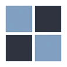

<div align=center>



# Boardmap

A board game heatmap visualizer providing real-time strategic pattern recognition for enhanced gameplay.

</div>

## Overview

Boardmap is a real-time board game visualization tool that generates strategic heatmaps to help players understand spatial reasoning and pattern recognition in board games. Built with Vue and designed with a polymorphic architecture for extensibility across multiple game types.

Board games, like Chess, are fun with friends. After playing Chess for a while, it occurred to me that I was just following rules moving one best step ahead. As the game progressed, I took the best one step forward each turn. No strategy, no plan. I had been following my gut, feeling/mood for the pieces or opponent. It always ended up in two ways: quick lose or rarely won by chance.

The traditional board game experience relies heavily on players' ability to visualize complex spatial relationships and strategic patterns. Many players, particularly those with spatial reasoning challenges or newcomers to strategic games, struggle to comprehend the full scope of piece influence, movement possibilities, and threat assessments across the board state. This creates a significant barrier to entry and limits strategic development for a substantial portion of the gaming community.

> [!NOTE]
> Boardmap's greatest strength lies in its ability to make complex strategic concepts immediately accessible while maintaining the intellectual depth of traditional games.

> [!CAUTION]
> Careful consideration must be given to balancing assistance with skill development.
> The tool serves as a learning aid rather than a crutch, encouraging users to gradually develop independent strategic thinking.

## Features

- [x] **Real-time Heatmaps**: Visualize piece influence, movement options, and threat analysis
- [x] **Interactive Gameplay**: Click-to-move interface with instant visual feedback
- [x] **Instant Updates**: Auto-refreshing visualizations with each move
- [x] **Polymorphic Architecture**: Extensible design supporting multiple game types

## Heatmap Types

| Type          | Description                                            | Color    |
| ------------- | ------------------------------------------------------ | -------- |
| **Influence** | Shows piece control strength and strategic positioning | 🔵 Blue  |
| **Movement**  | Visualizes available moves and mobility options        | 🟢 Green |
| **Threat**    | Highlights danger zones and opponent attack patterns   | 🔴 Red   |

### Game Support

- [x] **Checkers**: Full implementation with proper king movement
- [x] **Custom Games**: Extensible base classes for new game types: [Learn how](#adding-new-games)

## Live Demo

Try it yourself: [:rocket: Launch](https://henryhale.github.io/boardmap/)

## Quick Start

```bash
# clone the repository
git clone https://github.com/henryhale/boardmap.git

# navigate to project directory
cd boardmap

# install dependencies
pnpm install

# start development server
pnpm start
```

Open `http://localhost:5173` to view it in your browser.

## Usage

1. **Select a piece** by clicking on it (only current player's pieces)
2. **View possible moves** highlighted with green dots
3. **Make a move** by clicking on a highlighted square
4. **Toggle heatmaps** to see strategic insights
5. **Analyze patterns** using different visualization modes
6. **Reset the game** using the reset button to start a new game

## Heatmap Calculations

#### Influence Heatmap

- Base influence: 1 point per piece
- Mobility bonus: +0.3 per possible move
- King bonus: +2 points
- Positional bonuses: Back row (+0.5), sides (+0.3)
- Maximum capped at 5 points

#### Movement Heatmap

- Shows all squares pieces can move to
- Overlapping moves increase heat value
- Real-time updates with game state

#### Threat Heatmap

- Displays opponent attack patterns
- Higher values for squares containing your pieces
- Helps identify vulnerable positions

## Customization

### Adding New Games

1. Create a new class extending [GameEngine](./lib/core/engine.ts)
2. Implement all abstract methods
3. Add game-specific logic

Example:

```javascript
class ChessEngine extends GameEngine {
	constructor() {
		super(8) // 8x8 board
	}

	initializeBoard() {
		// Chess piece setup
	}

	isValidMove(fromRow, fromCol, toRow, toCol) {
		// Chess move validation
	}

	// ... other methods
}
```

### Customizing Heatmaps

Add new visualization types by extending [HeatmapCalculator](./lib/core/heatmap.ts):

```javascript
static calculateCustomHeatmap(gameEngine) {
  const heatmap = Array(gameEngine.boardSize).fill(null).map(() => Array(gameEngine.boardSize).fill(0));
  // Custom calculation logic
  // ...
  return heatmap;
}
```

## Acknowledgements

- [PixSim](https://henryhale.github.io/pixsim/) - project logo made manually using it's image creator
- [Vuejs](https://v3.vuejs.org) - seamless UI render and reactivity
- [TailwindCSS](https://v3.tailwindcss.com) - CSS made easy
- [Lucide Icons](https://lucide.dev) - free beautiful icons

## Contributing

1. Clone/fork the repository: `git clone https://github.com/henryhale/boardmap.git`
2. Create your feature branch `git checkout -b feature/amazing-feature`
3. Commit your changes `git commit -m 'Add amazing feature'`
4. Push to the branch `git push origin feature/amazing-feature`
5. Open a pull request

## License

This project is licensed under the MIT License - see the [LICENSE.txt](./LICENSE.txt) file for details.

Made with ❤️ by [Henry Hale](https://github.com/henryhale) with support from [Anthropic's Claude Code](https://anthropic.com/claude).
